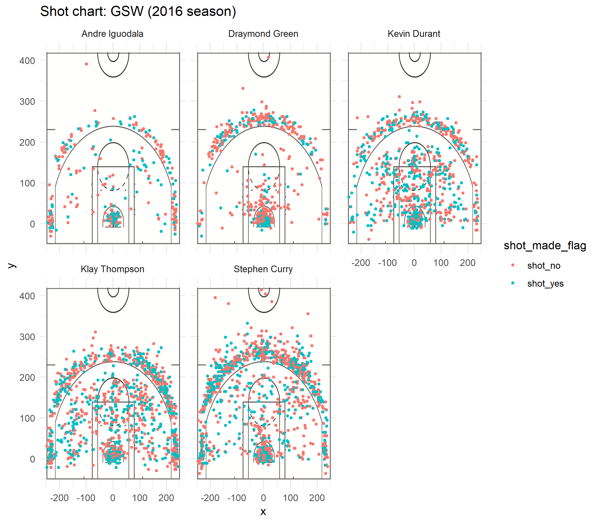
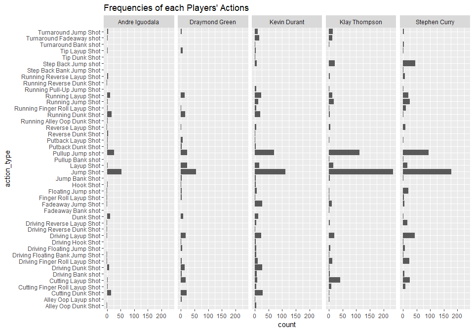
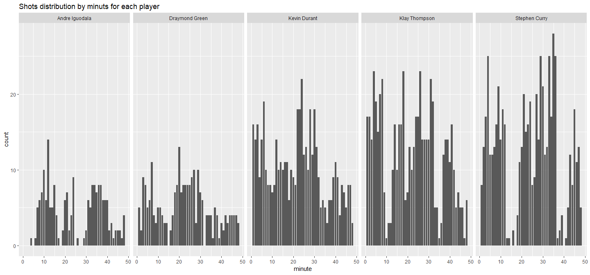

Workout 1
================
Jane Zhang
March 10, 2019

``` r
library(dplyr)
```

    ## 
    ## Attaching package: 'dplyr'

    ## The following objects are masked from 'package:stats':
    ## 
    ##     filter, lag

    ## The following objects are masked from 'package:base':
    ## 
    ##     intersect, setdiff, setequal, union

``` r
library(ggplot2)
```

5.1) Effective Shooting Percentage
==================================

``` r
shots_data <- read.table(file="../data/shots-data.csv",header = TRUE,sep=",")
pt2 <- shots_data[shots_data$shot_type=="2PT Field Goal",]
table_pt2 <- arrange(
            summarise(group_by(pt2,name),
                  total=length(shot_type),
                  made = sum(shot_made_flag == "shot_yes"),
                  perc_made =made/total ),
          desc(perc_made))
```

``` r
pt3 <- shots_data[shots_data$shot_type=="3PT Field Goal",]
table_pt3 <- arrange(
              summarise(group_by(pt3,name), 
                        total=length(shot_type), 
                        made = sum(shot_made_flag == "shot_yes"), 
                        perc_made =made/total ),
              desc(perc_made))
```

``` r
table_pt_total <- arrange(
            summarise(group_by(shots_data,name), 
                      total=length(shot_type),
                      made = sum(shot_made_flag == "shot_yes"),
                      perc_made =made/total ),
            desc(perc_made))
```

5.2) Report
===========

I. Introduction
---------------

Winning his first MVP award in season 2015 and let the league, Golden State Warrior (GSW), to their first championship since 1975, Curry has shown himself directly and become a legend by breaking records one after one. Becoming the focus of team, he continued impressing us by breaking the record of the most wins in an NBA season, and GSW made it to the 2016 NBA Finals. Beside Curry's legendary performance, how does other players' score this year? Why did Curry won the annimous and how did he earn the second winning score this year? Let's do some analysis about the scoring data of Stephen Curry, Andre Iguodala, Kevin Durant, Stephen Curry, Klay Thompson, and Draymond Green.

------------------------------------------------------------------------

II. Motivation
--------------

By analyzing and comparing Stephen Curry and his teammates' performance, find out what skills that make Curry an MVP and who else contributed efficient shootings to the team.

------------------------------------------------------------------------

III. Background of Golden State Warrior and Stephen Curry
---------------------------------------------------------

### 1.

Golden State Warriors, American professional basketball team based in Oakland, California, that plays in the Western Conference of the National Basketball Association (NBA). The Warriors have won five NBA championships (1956, 1975, 2015, 2017, and 2018) and one Basketball Association of America (BAA) title (1947).

### 2.

Stephen Curry, is a professional American basketball player with the Golden State Warriors. The son of former NBA player Dell Curry, Stephen first garnered national attention for his impressive play at Davidson College. He was drafted in 2009 by Golden State and eventually developed into one of pro basketball's top players with his stellar shooting skills. After garnering Most Valuable Player honors and helping the Warriors win the NBA championship in 2015, Curry led the team to a league-record 73 wins the following season. In May 2016, Curry became the first person to be named MVP by unanimous vote in NBA history.

------------------------------------------------------------------------

IV. Data and Analysis
---------------------

### 1) Shooting locations of shots

Where do players usually make their shot attempt? Let's take a look at a faceting scatter plot for each players, showing all the position of their attempts relative to the basketball court. The points in Klay Thompson and Stephen Curry's scatterplots are apparently denser than the other three. This indicating that Stephen Curry and Klay Thompson made the most attempts. Compared to Thompson, Curry make more attempts in the three points field, and the furthest successful shot Curry made was further than Thompson. Kevin Durant and Draymond Green also make a lot attempts, and Green's attempts is less than Durant.



### 2) Points per shot

Given the data of season 2016, I generated three tables for the shots made in two-point field, three-point field, and a table displaying their points per shot.

``` r
table_pt2
```

    ## # A tibble: 5 x 4
    ##   name           total  made perc_made
    ##   <fct>          <int> <int>     <dbl>
    ## 1 Andre Iguodala   210   134     0.638
    ## 2 Kevin Durant     643   390     0.607
    ## 3 Stephen Curry    563   304     0.540
    ## 4 Klay Thompson    640   329     0.514
    ## 5 Draymond Green   346   171     0.494

``` r
table_pt3
```

    ## # A tibble: 5 x 4
    ##   name           total  made perc_made
    ##   <fct>          <int> <int>     <dbl>
    ## 1 Klay Thompson    580   246     0.424
    ## 2 Stephen Curry    687   280     0.408
    ## 3 Kevin Durant     272   105     0.386
    ## 4 Andre Iguodala   161    58     0.360
    ## 5 Draymond Green   232    74     0.319

``` r
table_pt_total
```

    ## # A tibble: 5 x 4
    ##   name           total  made perc_made
    ##   <fct>          <int> <int>     <dbl>
    ## 1 Kevin Durant     915   495     0.541
    ## 2 Andre Iguodala   371   192     0.518
    ## 3 Klay Thompson   1220   575     0.471
    ## 4 Stephen Curry   1250   584     0.467
    ## 5 Draymond Green   578   245     0.424

From the shots in two-points field, we know that Andre Iguodala has the highest successful percentage of making shot in two points field, followed by Durant. Durant scored the highest total points for two-point shooting, followed by Thompson and Curry.

From the shots in three-points filed, it shows that Thompson has the highest successful percentage of making shots in three-points field, followed by Curry and Durant. Curry scored the highest total points for three-point shooting, followed by Thompson and Durant.

``` r
total_2pts <- (table_pt2$made)*2
total_3pts <- (table_pt3$made)*3
total_3pts <- total_3pts[c(4,3,2,1,5)]
total_pts <- total_2pts+total_3pts
total_atempt <- table_pt_total[c(2,1,4,3,5),2]
ppt <- total_pts/total_atempt
ppt$name <- table_pt2$name
ppt <- ppt[,c(2,1)]
colnames(ppt) <- c("name","points_per_shot")
ppt
```

    ##             name points_per_shot
    ## 1 Andre Iguodala       1.1913747
    ## 2   Kevin Durant       1.1967213
    ## 3  Stephen Curry       1.1584000
    ## 4  Klay Thompson       1.1442623
    ## 5 Draymond Green       0.9757785

Then I calculated the points per shot for each of them. Durant has the highest points per shot, and Iguodala ranks the second, followed by Curry.

Even Curry doesn't have the highest points per shot nor the highest successful percentage of making shots, overall he's still one of the top three among this five players sample. Thompson and Durant are also very efficient players with excellent skills. Having average 1.15 points per shot and relatively high shooting percentage making him a strong candidate of being an MVP. what else elements make him a MVP? According to According to the article, "the numbers Steph Curry incredible MVP season", the author said, "Quantified shot quality, or QSQ, accounts for shot location, defender location and what type of shot it was (catch-and-shoot, off the dribble, etc.), among other variables. We can use this same metric to identify shots off passes, too, and no player created higher-quality looks for his teammates than Steph Curry." So let's analyze the median of shooting distance. Besides points per shooting, there are other elements that our audiance take into consideration when they vote.

### 3) Median of shot distance

In part 1) we took a look at where their shooting locations were at by plotting facet scatter plots, now lets actually calculate the numerical average shooting distance and compare them. By calculating the minimum and maximum shooting distance of each players' shots' data, we get the shooting distance information of them as shown in the following table.

``` r
distance_each_player <- summarise( 
                          group_by( select(combine, c(name,shot_distance)), name),
                          median_dis = median(shot_distance),
                          max_dis = max(shot_distance))
distance_each_player
```

    ## # A tibble: 5 x 3
    ##   name           median_dis max_dis
    ##   <chr>               <dbl>   <dbl>
    ## 1 Andre Iguodala         18      49
    ## 2 Draymond Green          6      55
    ## 3 Kevin Durant           14      58
    ## 4 Klay Thompson          20      32
    ## 5 Stephen Curry          23      71

From the table, we can easily see that Curry has the highest median shooting distance and highest maximum distance, which is 23, and 71. This demonstrate how brilliantly Curry plays and he created such amazing shots that makes the game more fun to watch. He shoots from challenging distance with relatively high points per shot, which explains why he has gained so much spotlight.

On the other hand, Thompson has the second highest median shooting distance Next, lets look at some data about their shooting types.

### 4) Action types

The following tables individually count the top five frequently used actions of each players.

``` r
action_types_kevin <- kevin %>% filter(shot_made_flag == "shot_yes") %>% select(name,action_type) %>% group_by(name)
count_kevin <- count(action_types_kevin, vars=action_type)
count_kevin <- arrange(count_kevin, desc(n))
count_kevin
```

    ## # A tibble: 38 x 3
    ## # Groups:   name [1]
    ##    name         vars                         n
    ##    <chr>        <chr>                    <int>
    ##  1 Kevin Durant Jump Shot                  112
    ##  2 Kevin Durant Pullup Jump shot            71
    ##  3 Kevin Durant Cutting Dunk Shot           29
    ##  4 Kevin Durant Driving Dunk Shot           26
    ##  5 Kevin Durant Fadeaway Jump Shot          26
    ##  6 Kevin Durant Driving Layup Shot          23
    ##  7 Kevin Durant Running Layup Shot          23
    ##  8 Kevin Durant Running Dunk Shot           20
    ##  9 Kevin Durant Layup Shot                  15
    ## 10 Kevin Durant Turnaround Fadeaway shot    15
    ## # ... with 28 more rows

``` r
action_types_klay <- klay %>% filter(shot_made_flag == "shot_yes")%>% select(name,action_type) %>% group_by(name)
count_klay <- count(action_types_klay, vars=action_type)
count_klay <- arrange(count_klay, desc(n))

action_types_andre <- andre %>% filter(shot_made_flag == "shot_yes")%>% select(name,action_type) %>% group_by(name)
count_andre <- count(action_types_andre, vars=action_type)
count_andre <- arrange(count_andre, desc(n))

action_types_stephen <- stephen %>% filter(shot_made_flag == "shot_yes")%>% select(name,action_type) %>% group_by(name)
count_stephen <- count(action_types_stephen, vars=action_type)
count_stephen <- arrange(count_stephen, desc(n))

action_types_draymond <- graymond %>% filter(shot_made_flag == "shot_yes")%>% select(name,action_type) %>% group_by(name)
count_draymond <- count(action_types_draymond, vars=action_type)
count_draymond <- arrange(count_draymond, desc(n))

head_5_kevin <- head(count_kevin)
head_5_klay <- head(count_klay)
head_5_andre <- head(count_andre)
head_5_stephen <- head(count_stephen)
head_5_draymond <- head(count_draymond)
head_5_andre
```

    ## # A tibble: 6 x 3
    ## # Groups:   name [1]
    ##   name           vars                   n
    ##   <chr>          <chr>              <int>
    ## 1 Andre Iguodala Jump Shot             53
    ## 2 Andre Iguodala Pullup Jump shot      26
    ## 3 Andre Iguodala Running Dunk Shot     18
    ## 4 Andre Iguodala Cutting Dunk Shot     16
    ## 5 Andre Iguodala Running Layup Shot    12
    ## 6 Andre Iguodala Dunk Shot             11

``` r
head_5_draymond
```

    ## # A tibble: 6 x 3
    ## # Groups:   name [1]
    ##   name           vars                   n
    ##   <chr>          <chr>              <int>
    ## 1 Draymond Green Jump Shot             56
    ## 2 Draymond Green Layup Shot            23
    ## 3 Draymond Green Pullup Jump shot      22
    ## 4 Draymond Green Cutting Dunk Shot     21
    ## 5 Draymond Green Cutting Layup Shot    17
    ## 6 Draymond Green Driving Layup Shot    17

``` r
head_5_kevin
```

    ## # A tibble: 6 x 3
    ## # Groups:   name [1]
    ##   name         vars                   n
    ##   <chr>        <chr>              <int>
    ## 1 Kevin Durant Jump Shot            112
    ## 2 Kevin Durant Pullup Jump shot      71
    ## 3 Kevin Durant Cutting Dunk Shot     29
    ## 4 Kevin Durant Driving Dunk Shot     26
    ## 5 Kevin Durant Fadeaway Jump Shot    26
    ## 6 Kevin Durant Driving Layup Shot    23

``` r
head_5_klay
```

    ## # A tibble: 6 x 3
    ## # Groups:   name [1]
    ##   name          vars                    n
    ##   <chr>         <chr>               <int>
    ## 1 Klay Thompson Jump Shot             235
    ## 2 Klay Thompson Pullup Jump shot      112
    ## 3 Klay Thompson Cutting Layup Shot     41
    ## 4 Klay Thompson Step Back Jump shot    22
    ## 5 Klay Thompson Driving Layup Shot     19
    ## 6 Klay Thompson Running Jump Shot      18

``` r
head_5_stephen
```

    ## # A tibble: 6 x 3
    ## # Groups:   name [1]
    ##   name          vars                    n
    ##   <chr>         <chr>               <int>
    ## 1 Stephen Curry Jump Shot             178
    ## 2 Stephen Curry Pullup Jump shot       95
    ## 3 Stephen Curry Step Back Jump shot    46
    ## 4 Stephen Curry Driving Layup Shot     44
    ## 5 Stephen Curry Cutting Layup Shot     25
    ## 6 Stephen Curry Running Jump Shot      25

The following horizontal faceted bar charts listing the frequencies of each players' actions.

``` r
ggplot(data=filter(combine,shot_made_flag =="shot_yes"), aes(x=action_type)) + geom_bar() +facet_grid(~name)+ggtitle("Frequencies of each Players' Actions") +coord_flip()
```

 The most frequently used action is overall jump shot, and the second frequently used action is pullup jump shot. Both Kevin Durant, Klay Thompson and Stephen Curry have highest frequencies of using jump shot, Pullup jump shot, and driving layup shot. While Thompson has the most frequencies of using jump shot and pullup shot, and Curry ranks the second place.

### 5) Shots distribution by minutes

I generated a bar chart to show the distribution of successful shots by minutes faceting by players' names.

``` r
ggplot(data = filter(combine, shot_made_flag == "shot_yes"), aes(x=minute)) + geom_bar() + facet_grid(~name)+ ggtitle("Shots distribution by minuts for each player")
```

 From the bar charts, it's obvious that Curry shoots a lot more at the first 10 minutes and between 20 to 35 minutes than other four players. Thompson and Durant have high frequencies of shootings, but overall slightly lower than Curry. And in the last section, Curry have high shooting frequencies, showing that he led the team to win.

V. Conclusion
-------------

Curry's overall shooting skills are strong, and have high shooting quality, such as long-range shooting, relatively high scores per point and high shooting frequencies in first and last section of the game, which audience love. Other than Curry, Thompson and Durant's overall shooting skills are efficient and strong too.

IV. Reference
-------------

1.  *Stephen Curry wins MVP for second straight*

season"<http://www.espn.com/nba/story/_/id/15499690/stephen-curry-golden-state-warriors-first-unanimous-most-valuable-player>

1.  *the numbers Steph Curry incredible MVP season*

<http://www.espn.com/espn/feature/story/_/id/15492948/the-numbers-steph-curry-incredible-mvp-season>

1.  *Golden State Warriors*

<https://www.britannica.com/topic/Golden-State-Warriors>
